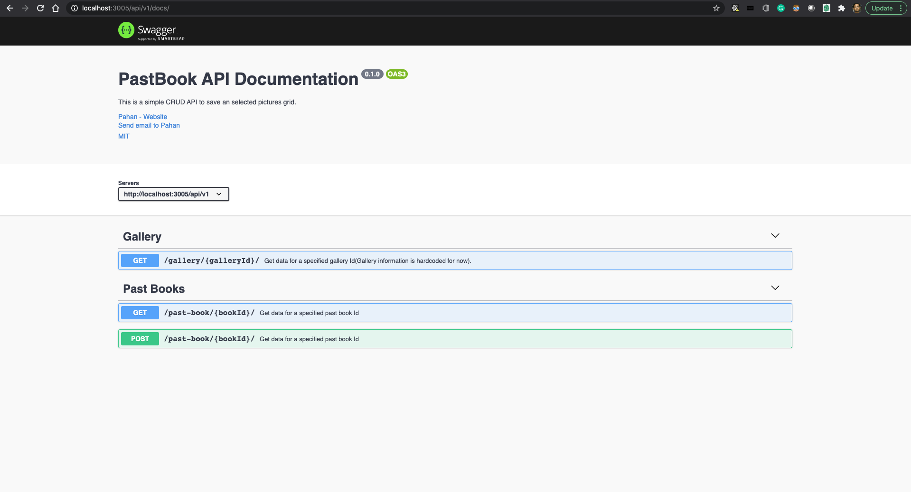

# Getting Started with Mementos - Pastbook
- Make sure you have [docker composer](https://docs.docker.com/compose/install/) installed
- Make sure 3005, 27017 ports are free
- Run `docker-compose up --build`
- Navigate to "http://localhost:3005/"
- Navigate to "http://localhost:3005/api/v1/docs" for api documentation

## See It In Action

### APP

### API documentation

## Known issues
- post request of Swagger UI console doesn't work